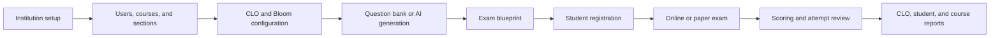

# QuizSystem Web Platform

QuizSystem is a multi-institution examination and learning-outcomes platform. It enables educational institutions to manage courses, CLOs, question banks, exam blueprints, online and printable exams, student attempts, and analytical reports from one web system.

## Business flow



## Main roles

- **Super administrator:** manages institutions and views platform-wide information.
- **Institution administrator:** manages institution users, courses, sections, students, registrations, and reports.
- **Course supervisor:** manages assigned courses, CLOs, questions, exams, student registrations, and attempt reviews.
- **Student:** completes assigned exams and views permitted results.

## Main use cases

- Create and manage multiple educational institutions.
- Assign one or more supervisors to a course.
- Define CLOs and map them to Bloom taxonomy levels.
- Import CLOs and questions through supported templates.
- Build general exams or CLO-linked exams.
- Generate questions using AI from an exam description and educational PDF content.
- Configure total questions, CLO distribution, Bloom distribution, attempt limits, and exam schedule.
- Deliver browser-based exams linked to the student identity.
- Produce printable paper-exam variants and answer-review forms.
- Register individual students or active students from a course section.
- Review, print, rank, and reset student attempts using controlled confirmation.
- Export student, course, exam, ranking, and CLO attainment reports.

## Technology stack

### Backend

- ASP.NET Core 9 Web API
- Entity Framework Core
- SQLite
- JWT authentication and role-based authorization
- QuestPDF and ClosedXML for PDF/Excel output
- SMTP email integration
- OpenAI API integration for assisted question generation

### Frontend

- React 19
- Vite
- React Router
- Axios
- Responsive Arabic/English interface with RTL/LTR support
- Nginx production hosting

### Runtime

- Docker and Docker Compose
- Mailpit for local email testing
- Persistent Docker volumes for database, uploads, and data-protection keys

## Repository structure

```text
.
├── backend/            # ASP.NET Core solution and API source
│   ├── src/
│   ├── Dockerfile
│   ├── docker-entrypoint.sh
│   └── QuizSystem.slnx
├── frontend/           # React web application
│   ├── public/
│   ├── src/
│   ├── Dockerfile
│   ├── nginx.conf
│   └── package.json
├── compose.yaml        # Complete web stack
├── .env.example        # Safe configuration template
├── .gitignore
└── README.md
```

The local `.env` file is intentionally excluded from Git.

## Database domains

The main data model is organized around:

- Institutions, users, roles, and profiles
- Grade levels, subjects, courses, sections, and enrollments
- Course learning outcomes and Bloom levels
- Question banks, questions, choices, and learning-outcome mappings
- Exams, blueprints, registrations, and printable variants
- Attempts, question snapshots, answers, violations, and scores
- Student account requests and email-verification workflow
- Reports and attainment calculations

Relationships are institution-scoped to support tenant isolation. Exams belong to courses, registrations connect students to exams, attempts preserve delivered question snapshots, and answers support scoring and CLO analysis.

## Configuration

Copy the safe template and enter local secrets:

```powershell
Copy-Item .env.example .env
```

Configure these values in `.env` as required:

- `OPENAI_API_KEY`
- `JWT_SECRET` (at least 32 random characters)
- `APP_FRONTEND_BASE_URL`
- `SMTP_HOST`
- `SMTP_PORT`
- `SMTP_ENABLE_SSL`
- `SMTP_USERNAME`
- `SMTP_PASSWORD`
- `SMTP_FROM`

Never commit `.env`, API keys, email passwords, databases, signing keys, or production certificates.

## Run with Docker

From the repository root:

```powershell
docker compose up --build -d
```

Services:

- Web application: `http://localhost:5190`
- Mailpit inbox: `http://localhost:8025`

Check status and logs:

```powershell
docker compose ps
docker compose logs -f api web
```

Stop the system:

```powershell
docker compose down
```

To remove persistent application data as well:

```powershell
docker compose down -v
```

## Local development

### Backend

```powershell
dotnet restore backend/QuizSystem.slnx
dotnet run --project backend/src/QuizSystem.Api/QuizSystem.Api.csproj
```

### Frontend

```powershell
Set-Location frontend
npm ci
npm run dev
```

## Acceptance test checklist

| Area | Test | Expected result |
|---|---|---|
| Authentication | Sign in with every supported role | Correct role dashboard and permissions are displayed |
| Tenant isolation | Request data from another institution | Access is denied and no foreign data is returned |
| Course assignment | Assign multiple supervisors to one course | Each supervisor sees only assigned courses and authorized services |
| CLO management | Create/import CLOs and Bloom mappings | Data is validated and available to questions and blueprints |
| Exam blueprint | Set CLO/Bloom counts above total questions | The system rejects the invalid distribution clearly |
| AI generation | Generate questions from description/PDF | Preview respects requested count and blueprint distribution |
| Registration | Register a section on an exam | Only active students in a section belonging to the exam course are added |
| Attempts | Start and submit an available exam | Attempt, answers, score, and timestamps are saved once |
| Attempt limit | Exceed configured attempts | The next attempt is blocked with a clear message |
| Reset | Reset a student attempt | Random-number confirmation is required before reset |
| Reports | Export ranking and CLO reports | PDF/Excel output matches filtered system data |
| Printing | Print a submitted student paper | Student/user/time watermark is included |
| Localization | Switch Arabic/English | RTL/LTR direction and alignment update correctly |
| Responsive UI | Use desktop, tablet, and mobile sizes | Forms, tables, and exam screens remain usable |
| Email | Verify, approve, reject, or reset account | Correct email and secure link are delivered |

## Build verification

```powershell
dotnet build backend/QuizSystem.slnx
Set-Location frontend
npm ci
npm run build
Set-Location ..
docker compose config
```

## Git workflow

```powershell
git add -A
git commit -m "Organize web-only QuizSystem source"
git push origin main
```

## Production notes

- Use a managed database for high-volume or multi-node deployments.
- Store secrets in the deployment platform's secret manager.
- Configure HTTPS, secure reverse-proxy headers, backups, monitoring, and retention policies.
- Rotate any credential that has ever appeared in source code or chat history.
- Run automated API, authorization, tenant-isolation, and browser tests before every release.

## License

This repository does not currently declare a public license. Add an appropriate license before third-party distribution.
